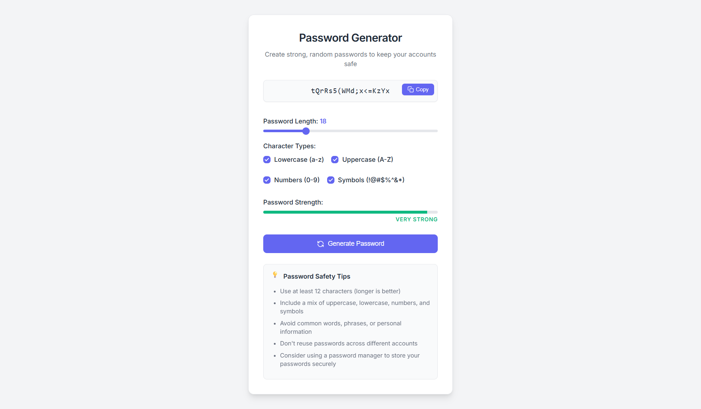

# 🔐 Password Generator



A modern and secure password generator built with **HTML**, **CSS**, and **JavaScript**. Easily generate strong passwords with customizable options and get real-time strength feedback. Features include animated UI, clipboard copy, and strength meter visualization.

### 🚀 [Live Demo](https://tikesh-sahu-git.github.io/Password-Generator/)

---

## ✨ Features

- ✅ Generate secure, random passwords
- 🎛 Customize length and character types (lowercase, uppercase, numbers, symbols)
- 📊 Real-time password strength meter with animated feedback
- ✨ Copy-to-clipboard with success animation
- 🔁 Smooth typewriter animation when generating new password
- 📱 Responsive design, works well on mobile and desktop

---

## 📸 Screenshot


---

## 🛠 Technologies Used

- **HTML5**
- **CSS3** (with custom properties and transitions)
- **Vanilla JavaScript** (ES6+)
- **Crypto API** for secure randomness

---

## 🧩 How to Use

1. Adjust the password length slider.
2. Select the desired character types.
3. Click the **"Generate Password"** button.
4. Click **"Copy"** to copy the password to clipboard.

---

## 💻 Getting Started (Clone Locally)

```bash
git clone https://github.com/Tikesh-sahu-git/Password-Generator.git
cd Password-Generator
open index.html
Or just open index.html in your browser.

📂 Project Structure
pgsql
Copy
Edit
Password-Generator/
├── index.html
├── style.css
├── script.js
├── Password-Generator.png
└── README.md
🔒 Password Strength Guide
Strength	Criteria
Weak	Short length or few character types
Medium	Moderate length and some variety
Strong	Long with 3+ character types
Very Strong 💪	4 character types and 16+ characters

📄 License
This project is open source and free to use under the MIT License.

🙌 Author
Tikesh Sahu
GitHub
